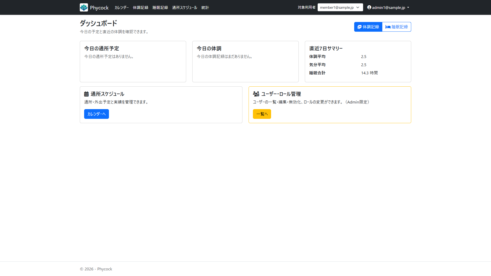
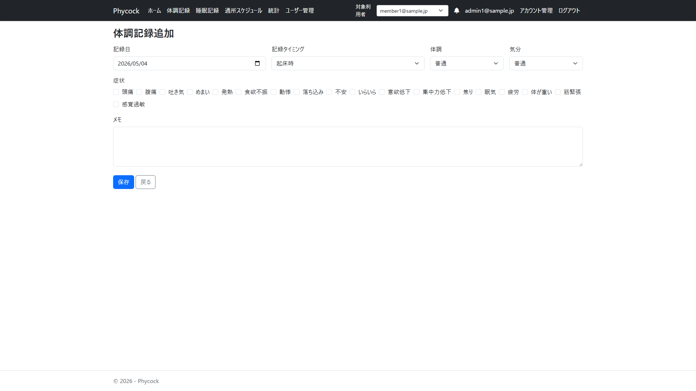
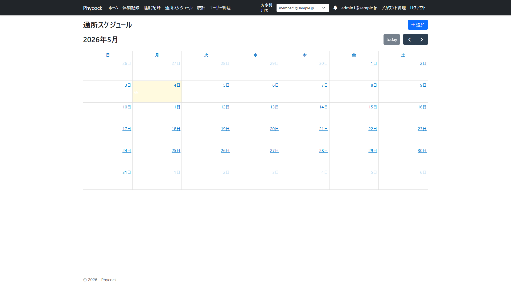
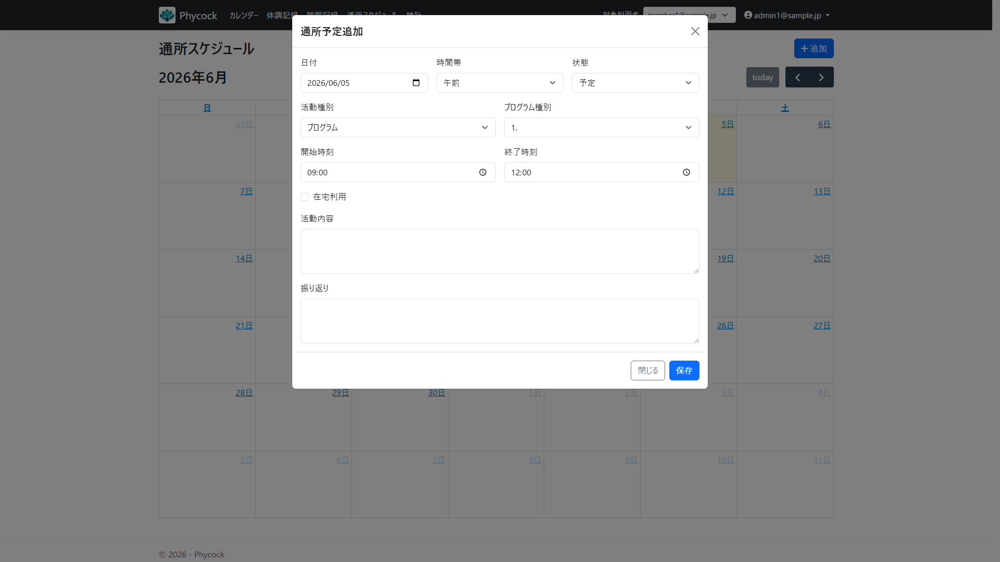
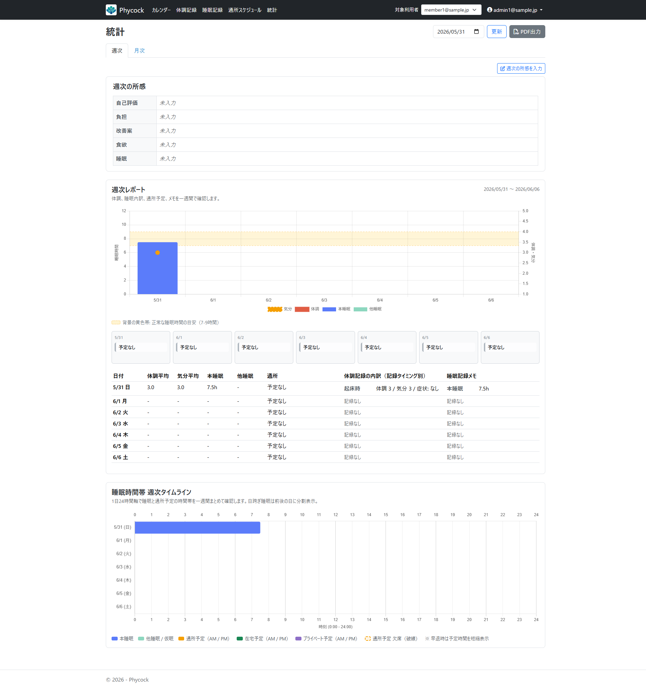

# Phycock（ピーコック）

**個人向け体調管理Webアプリ**

体調・睡眠・スケジュールを記録し、週次・月次の統計グラフとPDFレポートで日々の状態を可視化します。

---

## スクリーンショット

| ダッシュボード | 体調記録 |
|---|---|
|  |  |

| スケジュール（カレンダー） | スケジュール追加 |
|---|---|
|  |  |

| 統計ページ |
|---|
|  |

---

## 主な機能

| 機能 | 内容 |
|---|---|
| **体調記録** | 起床時・開始時・終了時・就眠時など複数タイミングで体調・気分・症状・メモを記録 |
| **睡眠記録** | 本睡眠・仮眠を区別して時刻・時間を記録。1日複数回対応 |
| **スケジュール管理** | FullCalendar で外出・在宅・プログラム等の予定を登録・カレンダー表示 |
| **週次統計** | 体調・気分・睡眠の折れ線/棒グラフ＋24時間タイムライン |
| **月次統計** | 月次複合チャート・日別カレンダーグリッド・所感入力 |
| **PDF出力** | 週次レポート・月次レポートをPDFとしてダウンロード |
| **ユーザー管理** | Admin が複数 Member を管理。対象ユーザー切替に対応 |
| **モバイル対応** | Bootstrap 5 によるレスポンシブデザイン |

---

## 技術スタック

| レイヤー | 技術 |
|---|---|
| フレームワーク | ASP.NET Core 10 MVC |
| ORM | Entity Framework Core 10 |
| 認証 | ASP.NET Core Identity |
| データベース | SQL Server（開発: LocalDB） |
| フロントエンド | Bootstrap 5 / FullCalendar.js / Chart.js |
| PDF生成 | Playwright（Chromiumヘッドレス印刷） |
| テスト | xUnit + Moq |

---

## セットアップ

### 前提条件

- [.NET 10 SDK](https://dotnet.microsoft.com/download)
- SQL Server または SQL Server LocalDB

### 手順

```bash
# 1. リポジトリをクローン
git clone https://github.com/harness17/phycock.git
cd phycock

# 2. 接続文字列を設定
#    appsettings.json の "ConnectionStrings:DefaultConnection" を編集するか
#    環境変数 ConnectionStrings__DefaultConnection を設定する

# 3. 依存パッケージ復元 & DB マイグレーション
dotnet restore
dotnet ef database update --project Phycock --startup-project Phycock

# 4. Playwright Chromium インストール（PDF出力用）
dotnet build Phycock
pwsh Phycock/bin/Debug/net10.0/.playwright/package/bin/playwright.ps1 install chromium

# 5. 起動
dotnet run --project Phycock
```

ブラウザで `http://localhost:5232` を開いてください。

### 初期ユーザー

マイグレーション実行時にシードデータが投入されます。

| ロール | メールアドレス | パスワード |
|---|---|---|
| Admin | admin1@sample.jp | Admin1! |
| Member | member1@sample.jp | Member1! |

---

## テスト

```bash
dotnet test
```

---

## ライセンス

[MIT License](LICENSE)

---

## 作者

[harness17](https://github.com/harness17)
